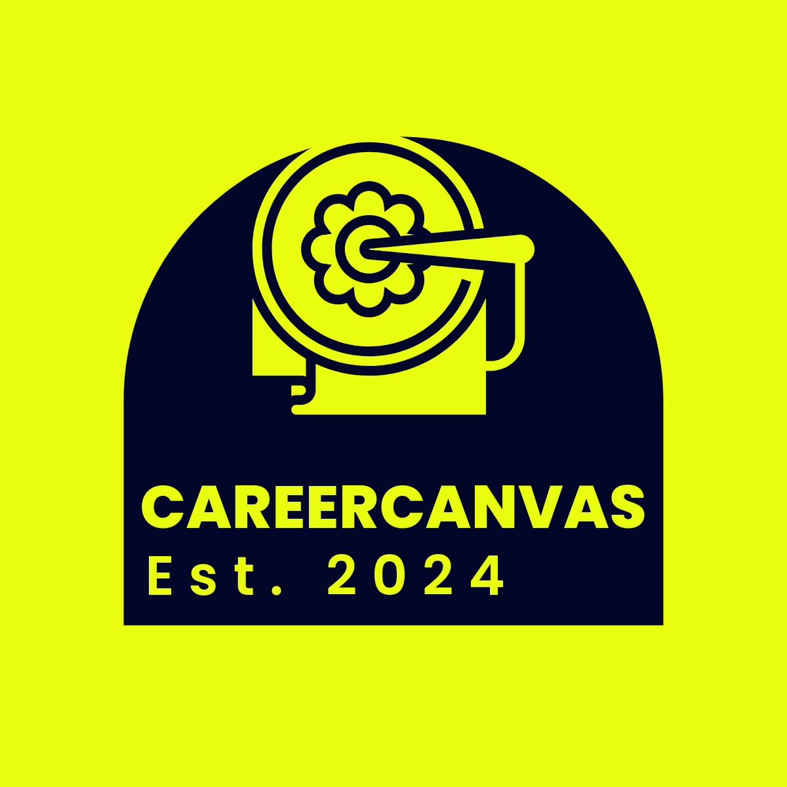

# Overview
CareerCanvas serves as a service to support recent graduates navigate their career journey. CareerCanvas focuses on Resume help driven by AI, Mock Interviews as well as help graduates find entry level jobs and rotational programs offered by companies.
                                        

# CareerCanvas: What is it?
The term "Grad" signifies various recent graduates who are looking to navigate their career journey. Here, through our virtual assistant, graduates can be guided through their career path by providing assistance in mock interviews and locating both rotational and entry-level positions they may be interested in. 

# Why CareerCanvas?
While the unemployment rate of recent graduated rising, more and more people are stressed about finding a job after graduating. CareerCanvas can provide the resources needed for graduates by incorporating 3 different features that are usually on seperate websites on the same application. Moreover, utilizing generative AI in our application, users can receive instand feedback and recommendations of their resume and practice interview of differnet job roles using a chat bot. The all-in-one application will make job hunting an easier process for the graduates.

# Feature 1: Resume Feedback Tool
This feature serves to give feedback on resumes uploaded. Feedback and recommendation on career paths will be provided based on the uploaded resume . Users ought to be careful with the content of PDF file as information will be fed to Open AI GPT text generation model gpt-3.5-turbo. 

# Feature 2: Mock Interview Tool
Our tool allows for users to input an audio file through the interface and for AI to serve as an interactive interview practice platform. 

# Feature 3: Entry-level and rotational programs Tool
This feature allows for the retrieval of job postings from the Adzuna API, where the user can specify the job title and location to search for job postings. 
